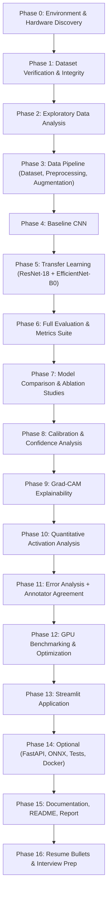

# Explainable Deep-Learning Pipeline for Histopathology Image Analysis

## A. Critical Analysis of the Project Plan

### What you got right
Your plan is one of the most thorough, research-aware portfolio project specs I've seen. The emphasis on honesty, measured results, medical relevance, and anti-keyword-stuffing discipline is exactly the right instinct. The annotator-agreement analysis angle is a genuine research differentiator — most portfolio projects ignore it entirely.

### What needs adjustment

| Issue | Assessment | Recommendation |
|-------|-----------|----------------|
| **Scope creep risk** | 49 sections is a full research paper + production system + deployment pipeline. Doing everything at equal depth will result in a shallow project. | Ruthlessly tier into **Core / Strong / Optional**. Cut anything that doesn't improve your interview story. |
| **Second dataset for segmentation** | You flagged this correctly. Adding a segmentation dataset doubles project scope and fractures focus. | **Do NOT add a second dataset.** Instead, use Grad-CAM-derived pseudo-localization as an "activation analysis" module. This is honest, technically interesting, and keeps scope tight. |
| **Cross-validation** | MHIST ships with a fixed official train/test split (2,175 / 977). Using k-fold on top of this is non-standard for this benchmark and makes your results non-comparable to published work. | Use the official split. Create a stratified validation set carved from the training split (~15%). Report this clearly. Mention k-fold as a limitation/future-work item. |
| **C++ component** | For a portfolio project where you're demonstrating Python/PyTorch depth, a token C++ module will look bolted-on and won't survive an interview deep-dive. | **Skip C++.** Instead, demonstrate performance engineering via ONNX export, quantization benchmarking, and mixed-precision — these are what AIRA Matrix actually uses in production. Mention C++ competency in your resume separately. |
| **ViT experiment** | ViT on 224×224 patches with 3,152 samples and no pretraining data will underperform and won't teach anything interesting. | **Optional at best.** Only include if you have a ViT-Tiny pretrained checkpoint and want a "CNN vs Transformer" comparison row in your table. |
| **Statistical tests (McNemar, DeLong)** | Valid but marginal for a portfolio project. Risk of looking like p-value mining. | Keep bootstrap CIs for key metrics. Drop McNemar/DeLong unless specifically asked in an interview. |
| **Stain normalization** | MHIST images are already 224×224 curated patches. Stain variation is minimal compared to whole-slide images. Adding Macenko/Vahadane normalization may not produce a measurable effect. | Include as an **ablation experiment** ("with vs without"), report the result, and discuss why it may/may not matter for pre-cropped patches vs WSI. This shows awareness without fake claims. |
| **Hausdorff distance** | Requires ground-truth segmentation masks. MHIST has none. | **Remove.** Only applicable if you add a real segmentation dataset (which I'm recommending against). |
| **Docker GPU mode** | Requires NVIDIA Container Toolkit setup, adds debugging complexity, and interviewers won't run your Docker image. | Include a simple CPU Dockerfile. Document GPU setup in README but don't make it a deliverable. |

---

## B. Mandatory / Optional / Unnecessary / Risky / Questionable

### ✅ Mandatory (Must-have for AIRA Matrix relevance)

| Component | Why |
|-----------|-----|
| MHIST binary classification pipeline | Core task |
| Transfer learning (ResNet-18, EfficientNet-B0) | Directly relevant to AIRA's work |
| Simple CNN baseline | Shows progression, interview talking point |
| Comprehensive metric suite | Medical AI differentiation |
| Confusion matrix + clinical metrics (Sens/Spec/PPV/NPV) | AIRA does diagnostic AI |
| ROC analysis + threshold optimization | Clinical decision-making awareness |
| PR-AUC analysis | Class imbalance handling |
| Model calibration (ECE, reliability diagram, Brier) | Critical for medical AI trust |
| Confidence/probability analysis | Shows you understand model outputs aren't just labels |
| Grad-CAM explainability | AIRA's products need interpretability |
| Quantitative activation analysis | Demonstrates "image quantification" — core AIRA skill |
| Annotator agreement analysis | **Research differentiator** — ties model difficulty to human difficulty |
| Error analysis with visual examples | Shows scientific rigor |
| GPU benchmarking (CPU vs GPU vs AMP) | AIRA values efficient inference |
| Model comparison table (accuracy vs compute trade-off) | Engineering maturity |
| Ablation studies (augmentation, fine-tuning, loss) | Research methodology |
| Image preprocessing + EDA | Foundation for everything |
| Reproducibility (seeds, configs, requirements.txt) | Professional engineering |
| Data leakage checks | Scientific rigor |
| Streamlit demo app | Tangible deliverable |
| Professional README | GitHub portfolio essential |

### 🟡 Strong Optional (High value, include if time permits)

| Component | Why |
|-----------|-----|
| FastAPI endpoint | Production-readiness signal |
| ONNX export + quantization benchmark | Model optimization depth |
| Bootstrap confidence intervals | Statistical rigor |
| Classical CV comparison (Otsu, morphology, color-space) | Shows breadth beyond deep learning |
| Temperature scaling (calibration improvement) | Advanced calibration |
| Research-style report | Academic rigor signal |
| Unit tests for core components | Software engineering quality |

### ⚠️ Optional (Lower priority, include only if natural)

| Component | Why |
|-----------|-----|
| Docker (CPU-only) | Nice-to-have, won't make/break |
| torch.compile / TorchScript | Optimization depth but diminishing returns |
| ViT experiment | Only if pretrained weights available and quick |
| Stain normalization ablation | Likely minimal effect on MHIST but shows awareness |
| Interview question generation | Can be done at the end in 30 minutes |

### ❌ Remove / Do Not Include

| Component | Why |
|-----------|-----|
| Second segmentation dataset | Scope explosion, dilutes focus |
| C++ module | Token effort won't survive interview scrutiny |
| Hausdorff distance | No ground-truth masks |
| Segmentation metrics (Dice, IoU) on Grad-CAM | Scientifically dishonest unless clearly framed as research experiment |
| k-fold cross-validation | Non-standard for MHIST benchmark, wastes compute |
| McNemar's / DeLong tests | Marginal value, p-value mining risk |
| Docker GPU mode | Debugging sink |
| Focal loss (unless class imbalance ablation justifies) | HP:SSA ratio is 2.18:1 — moderate, not extreme. Weighted CE is sufficient. |

---

## C. AIRA Matrix Coverage Matrix

| AIRA Requirement | Project Component | Coverage | Evidence |
|------------------|-------------------|----------|----------|
| Medical image analysis | MHIST histopathology classification | ✅ Full | End-to-end pipeline on H&E colorectal tissue |
| Image processing | Preprocessing, normalization, color analysis, EDA | ✅ Full | Dedicated preprocessing module + classical CV comparison |
| Computer vision | CNN architectures, feature extraction, Grad-CAM | ✅ Full | Baseline CNN + transfer learning + activation analysis |
| Pattern recognition | Classification + error pattern analysis | ✅ Full | Per-class error modes, annotator agreement correlation |
| Machine learning | Model comparison, ablation, hyperparameter analysis | ✅ Full | Systematic experiments with controlled variables |
| Deep learning | PyTorch CNN, ResNet, EfficientNet, training strategies | ✅ Full | Multiple architectures, fine-tuning strategies |
| Image classification | Binary HP vs SSA classification | ✅ Full | Core task with comprehensive metrics |
| Image segmentation | Grad-CAM activation analysis (pseudo-localization) | 🟡 Partial | Honest framing as attention-based analysis, not true segmentation |
| Object/region detection | Quantitative activation region analysis | 🟡 Partial | Connected-component analysis on activation maps |
| Image quantification | Activation area, region stats, tissue analysis | ✅ Full | Quantitative metrics from Grad-CAM + classical CV measurements |
| High-resolution pathology | Discussion of WSI pipeline design | 🟡 Partial | MHIST is patch-level; discuss WSI extension in report/README |
| Digital pathology | H&E stain analysis, pathology-specific preprocessing | ✅ Full | Stain-aware processing, clinical metric interpretation |
| Efficient algorithms | ONNX, quantization, mixed precision, benchmarking | ✅ Full | Measured speedup/accuracy trade-offs |
| Python | Entire codebase | ✅ Full | Modular, typed, PEP-8, configurable |
| C / C++ | Not included (by recommendation) | ❌ None | Mention competency in resume; token code wouldn't help |
| GPU computing | CUDA training, mixed precision, GPU benchmarking | ✅ Full | Measured GPU vs CPU speedup |
| Deep learning frameworks | PyTorch throughout | ✅ Full | Training, inference, export, optimization |
| Real-time inference | Latency benchmarking, throughput measurement | ✅ Full | ms/image and images/sec metrics |
| Software engineering | Modular code, configs, tests, API, Docker | ✅ Full | Professional repository structure |
| Research / publications | Research-style report, ablation studies, statistical analysis | ✅ Full | Structured like a paper; annotator agreement is novel angle |

**Overall coverage: 16/19 full, 3/19 partial, 0 critical gaps.**

The three partial coverages (segmentation, detection, high-res pathology) are inherent limitations of the MHIST dataset, not of the project design. Your README should explicitly discuss how the pipeline could extend to WSI-level analysis.

---

## D. Is MHIST Sufficient? Do We Need a Second Dataset?

**Verdict: MHIST alone is sufficient. Do NOT add a second dataset.**

### Why MHIST is enough

1. **Clinical relevance**: HP vs SSA classification is a real diagnostic challenge — SSA is precancerous and missed diagnosis has clinical consequences.
2. **Annotator agreement data**: This is rare and valuable. The 7-pathologist agreement scores let you do genuinely interesting analysis that most portfolios can't.
3. **Benchmark comparability**: Published baseline is ResNet-18 with AUC 92.7%. You can compare your results directly.
4. **Compute-friendly**: 3,152 images at 224×224 — full experiment suite will run in hours, not days.
5. **Class imbalance**: HP:SSA = 2162:990 (2.18:1) — enough imbalance to make PR-AUC, balanced accuracy, and weighted loss meaningful, but not so extreme that it dominates the project.

### Why a second dataset would hurt

- Doubles implementation time, doubles debugging surface
- Splits your narrative — interviewer asks "which is the main project?"
- Segmentation requires fundamentally different architectures, losses, and metrics
- You'd need U-Net + Dice loss + mask loading pipeline — all new code for one experiment
- Risk of shallow coverage on both datasets instead of deep coverage on one

### What to say in interviews about segmentation/WSI

> "MHIST provides curated patch-level images. In a production digital pathology pipeline like AIRA's products, these patches would come from a whole-slide image processing stage — tissue detection, tiling, and quality filtering. I designed the pipeline to be extensible: the classification module accepts any 224×224 patch, and the quantitative analysis module could aggregate per-patch results into slide-level heatmaps. I focused depth on the classification and analysis pipeline rather than spreading thin across classification and segmentation."

---

## E. Recommended Final Project Scope

### Project Title
**"Explainable AI for Histopathology: Classification, Calibration, and Quantitative Analysis of Colorectal Polyp Images"**

### Scope Summary

```
┌─────────────────────────────────────────────────────────────┐
│                    CORE (Must Complete)                       │
├─────────────────────────────────────────────────────────────┤
│ • MHIST dataset pipeline (load, validate, split, preprocess) │
│ • Comprehensive EDA + annotator agreement analysis           │
│ • Image preprocessing + augmentation (histopath-appropriate) │
│ • 3 models: SimpleCNN → ResNet-18 → EfficientNet-B0         │
│ • Transfer learning with frozen → fine-tuned progression     │
│ • Full metric suite (20+ metrics, grouped by importance)     │
│ • ROC/PR analysis with threshold optimization                │
│ • Calibration analysis (ECE, reliability diagram, Brier)     │
│ • Confidence analysis (distribution, by outcome category)    │
│ • Grad-CAM explainability                                    │
│ • Quantitative activation analysis (area, components, etc.)  │
│ • Error analysis (visual + statistical)                      │
│ • Annotator agreement vs model difficulty correlation        │
│ • Ablation studies (≥3 controlled experiments)               │
│ • Model comparison table (accuracy + compute)                │
│ • GPU benchmarking (CPU vs GPU vs AMP)                       │
│ • Streamlit demo application                                 │
│ • Professional README + documentation                        │
│ • Reproducibility (seeds, configs, requirements.txt)         │
├─────────────────────────────────────────────────────────────┤
│                   STRONG OPTIONAL                            │
├─────────────────────────────────────────────────────────────┤
│ • FastAPI inference endpoint                                 │
│ • ONNX export + quantization benchmarking                    │
│ • Bootstrap confidence intervals                             │
│ • Classical CV comparison (Otsu, morphology, color spaces)   │
│ • Temperature scaling for calibration                        │
│ • Unit tests                                                 │
│ • Research-style report                                      │
├─────────────────────────────────────────────────────────────┤
│                    LOW PRIORITY                              │
├─────────────────────────────────────────────────────────────┤
│ • Docker (CPU-only)                                          │
│ • Stain normalization ablation                               │
│ • ViT experiment                                             │
│ • Interview Q&A generation                                   │
└─────────────────────────────────────────────────────────────┘
```

### Estimated Time (assuming ~4-6 hours/day)

| Phase | Time Estimate |
|-------|--------------|
| Environment + dataset setup | 0.5 day |
| EDA + data validation | 1 day |
| Data pipeline + preprocessing | 1 day |
| Baseline CNN | 0.5 day |
| Transfer learning (ResNet + EfficientNet) | 1 day |
| Full evaluation + metrics | 1 day |
| Model comparison + ablation | 1 day |
| Explainability (Grad-CAM + quantitative) | 1 day |
| Error analysis + annotator agreement | 1 day |
| Calibration + confidence analysis | 0.5 day |
| GPU benchmarking + optimization | 0.5 day |
| Streamlit app | 1 day |
| Documentation + README | 1 day |
| **Core total** | **~10–11 days** |
| Optional: FastAPI + ONNX + tests | 2 days |
| Optional: Report + Docker | 1-2 days |
| **Full total** | **~13–15 days** |

---

## F. Metrics — Grouped by Priority

### 1. Mandatory Metrics (Report for every model)

| Metric | Why it matters for medical imaging |
|--------|------------------------------------|
| **Accuracy** | Baseline reference, but misleading with imbalance |
| **Balanced Accuracy** | Corrects for the 2.18:1 HP:SSA imbalance |
| **Sensitivity (Recall/TPR)** | Catching SSA (precancerous) — missing it has consequences |
| **Specificity (TNR)** | Correctly identifying HP — avoiding unnecessary procedures |
| **Precision (PPV)** | Of predicted SSAs, how many are truly SSA? |
| **NPV** | Of predicted HPs, how many are truly HP? |
| **F1 Score** | Harmonic mean balancing precision and recall |
| **MCC** | Single metric that uses all 4 confusion matrix entries; robust to imbalance |
| **ROC-AUC** | Threshold-independent discrimination measure |
| **PR-AUC (Average Precision)** | Better than ROC-AUC when classes are imbalanced |
| **Confusion Matrix** | Foundation for everything above |
| **ECE (Expected Calibration Error)** | Are probabilities trustworthy? Critical for medical AI. |
| **Brier Score** | Overall probability quality; combines calibration + discrimination |

### 2. Highly Useful Metrics (Include in detailed analysis)

| Metric | Why |
|--------|-----|
| **FPR, FNR** | Direct clinical interpretation |
| **FDR (False Discovery Rate)** | 1 − PPV; useful for understanding positive predictions |
| **FOR (False Omission Rate)** | 1 − NPV; risk of missed SSA |
| **Cohen's Kappa** | Agreement beyond chance; useful to compare model vs annotator |
| **Youden's J statistic** | Optimal threshold selection |
| **Threshold analysis table** | Sensitivity/Specificity at multiple thresholds |
| **Confidence intervals (bootstrap)** | Statistical rigor for key metrics |
| **Max Calibration Error** | Worst-case calibration bin |
| **Per-class F1** | Understand performance asymmetry |
| **Macro F1** | Unweighted average across classes |

### 3. Optional / Research Metrics

| Metric | Why it's optional |
|--------|------------------|
| **LR+, LR−** | Useful in clinical epidemiology but uncommon in ML papers |
| **Diagnostic Odds Ratio** | Rarely reported in CV literature |
| **Weighted F1** | Less informative than macro F1 for binary tasks |
| **Negative Likelihood Ratio** | Niche |

---

## G. Metrics That Would Be Misleading or Unnecessary

| Metric | Why to avoid or caveat |
|--------|----------------------|
| **Accuracy alone** | HP:SSA is 2.18:1. A model predicting "HP always" gets 68.6% accuracy. Always pair with balanced accuracy. |
| **Weighted F1 as primary** | Weights by class support, so HP dominates. Masks poor SSA performance. |
| **Dice / IoU / pixel accuracy** | No segmentation masks exist. Cannot be calculated honestly. |
| **Hausdorff distance** | Requires contour ground truth. Not applicable. |
| **Clinical sensitivity/specificity claims** | MHIST is a research dataset, not a clinical validation cohort. Always caveat. |
| **Segmentation metrics on Grad-CAM** | Grad-CAM is not a segmentation method. Can only do "activation analysis." |

---

## H. Hardware/Environment Information Needed Before Phase 0

I need you to run the following commands and share the output. This will let me calibrate batch sizes, mixed precision settings, and training schedules to your exact hardware.

```python
# Save as: check_hardware.py
# Run: python check_hardware.py

import torch
import platform
import psutil
import shutil
import sys

print("=" * 60)
print("SYSTEM INFORMATION")
print("=" * 60)

# Python
print(f"Python version: {sys.version}")
print(f"Platform: {platform.platform()}")
print(f"Processor: {platform.processor()}")

# CPU
print(f"CPU cores (logical): {psutil.cpu_count(logical=True)}")
print(f"CPU cores (physical): {psutil.cpu_count(logical=False)}")

# RAM
ram = psutil.virtual_memory()
print(f"Total RAM: {ram.total / (1024**3):.1f} GB")
print(f"Available RAM: {ram.available / (1024**3):.1f} GB")

# Disk
disk = shutil.disk_usage(".")
print(f"Disk total: {disk.total / (1024**3):.1f} GB")
print(f"Disk free: {disk.free / (1024**3):.1f} GB")

# PyTorch
print(f"\nPyTorch version: {torch.__version__}")
print(f"CUDA available: {torch.cuda.is_available()}")

if torch.cuda.is_available():
    print(f"CUDA version: {torch.version.cuda}")
    print(f"cuDNN version: {torch.backends.cudnn.version()}")
    print(f"GPU count: {torch.cuda.device_count()}")
    for i in range(torch.cuda.device_count()):
        props = torch.cuda.get_device_properties(i)
        print(f"\nGPU {i}: {props.name}")
        print(f"  Compute capability: {props.major}.{props.minor}")
        print(f"  Total memory: {props.total_mem / (1024**3):.1f} GB")
        print(f"  SM count: {props.multi_processor_count}")
    
    # Test mixed precision support
    try:
        with torch.cuda.amp.autocast():
            x = torch.randn(2, 3, device='cuda')
            y = x @ x.T
        print(f"\nMixed precision (AMP): Supported")
    except Exception as e:
        print(f"\nMixed precision (AMP): Not supported ({e})")
else:
    print("No CUDA GPU detected — project will run on CPU")

# Check key packages
print("\n" + "=" * 60)
print("KEY PACKAGES")
print("=" * 60)
for pkg in ['torchvision', 'numpy', 'pandas', 'matplotlib',
            'scikit-learn', 'Pillow', 'scipy', 'tqdm',
            'pyyaml', 'streamlit', 'fastapi', 'onnx', 'onnxruntime']:
    try:
        mod = __import__(pkg.replace('-', '_').split('.')[0])
        ver = getattr(mod, '__version__', 'installed')
        print(f"  {pkg}: {ver}")
    except ImportError:
        print(f"  {pkg}: NOT INSTALLED")
```

---

## I. Final Phased Roadmap



### Phase Details

| Phase | What | Key Deliverable | Depends On |
|-------|------|-----------------|------------|
| **0** | Run hardware check script; install missing packages; verify CUDA | Hardware profile → adapted config | — |
| **1** | Verify all 3,152 images load; check for corruption; match annotations to files; validate labels | Data validation report | P0 |
| **2** | Class distribution, pixel stats, RGB histograms, annotator agreement distribution, sample montages | EDA notebook + figures | P1 |
| **3** | PyTorch Dataset class, train/val/test split (from official train: 85/15 stratified val split + official test), preprocessing pipeline, augmentation pipeline | `src/data/` modules | P2 |
| **4** | Simple 4-layer CNN, train from scratch, establish floor performance | Baseline metrics + model checkpoint | P3 |
| **5** | ResNet-18 (frozen → fine-tuned), EfficientNet-B0 (frozen → fine-tuned) | Two transfer learning models + metrics | P3 |
| **6** | Full metric suite for all models: confusion matrix, 20+ metrics, ROC curve, PR curve, threshold analysis | `outputs/metrics/` JSONs + figures | P4, P5 |
| **7** | Model comparison table, ablation studies (augmentation, fine-tuning, loss weighting) | Comparison table + ablation table | P6 |
| **8** | Reliability diagram, ECE, Brier score, temperature scaling, confidence distributions by TP/TN/FP/FN | Calibration figures + metrics | P6 |
| **9** | Grad-CAM implementation, example grids for all outcome categories | `outputs/gradcam/` visualizations | P5 |
| **10** | Activated area %, connected components, region statistics, class comparison | Quantitative analysis report | P9 |
| **11** | Error categorization, visual error examples, annotator agreement vs model confidence correlation | Error analysis report | P6, P9 |
| **12** | CPU vs GPU vs AMP benchmarks, throughput, latency, ONNX export if time permits | Benchmark table | P5 |
| **13** | Upload → predict → Grad-CAM → confidence → quantitative stats | Working Streamlit app | P5, P9, P10 |
| **14** | FastAPI endpoint, ONNX optimization, unit tests, Dockerfile | Optional deliverables | P13 |
| **15** | README.md, research report, limitations, future work | Final documentation | All |
| **16** | Resume bullets with real measured numbers, interview Q&A | Career materials | P15 |

---

## Key Dataset Facts Confirmed from Your Data

| Property | Value |
|----------|-------|
| Total images | 3,152 |
| Image size | 224 × 224 × 3 (PNG) |
| Classes | HP (Hyperplastic Polyp), SSA (Sessile Serrated Adenoma) |
| HP count | 2,162 (68.6%) |
| SSA count | 990 (31.4%) |
| Class ratio | 2.18 : 1 (moderate imbalance) |
| Official train | 2,175 (HP: 1,545 / SSA: 630) |
| Official test | 977 (HP: 617 / SSA: 360) |
| Annotators | 7 board-certified GI pathologists |
| SSA annotator range | 0–7 (full agreement spectrum) |
| Published baseline | ResNet-18, AUC = 92.7% |

### Annotator Agreement Distribution (Critical for Phase 11)

| # Annotators selecting SSA | Count | Interpretation |
|---------------------------|-------|----------------|
| 0 | 723 | Strong HP consensus |
| 1 | 705 | Strong HP consensus |
| 2 | 426 | Moderate HP leaning |
| 3 | 308 | **Ambiguous** — near 50/50 split |
| 4 | 216 | Moderate SSA leaning |
| 5 | 168 | Moderate SSA consensus |
| 6 | 250 | Strong SSA consensus |
| 7 | 356 | Strong SSA consensus |

> [!IMPORTANT]
> The "difficult" zone (3-4 annotators selecting SSA) contains **524 images (16.6%)**. These are cases where even expert pathologists disagree. Correlating model errors with annotator disagreement will be the most impressive research component of this project.

---

## Awaiting Your Input

Before we begin Phase 0, I need:

1. **Your confirmation** that the scope above looks right to you
2. **Hardware info** — run the `check_hardware.py` script above and paste the output
3. Any changes to the priority tiers (anything you want to promote from Optional to Core, or anything you want to cut?)
